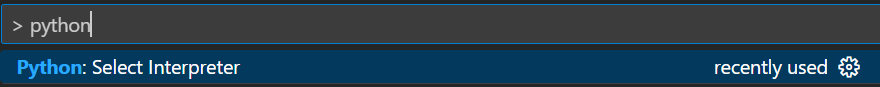

# win新电脑安装指南
## 本博客主要用于windows笔记本到手后，重装后的一些配置，软件推荐。
- 验机简易指南
  - 1.取到快递时查看包装袋是否破碎，是否进水有水渍。全程开箱录视频。
  - 2.拿出电脑，观察外观，机器刚性，外壳螺丝等是否有痕迹。把笔记本放在桌子上看是否变形，脚垫阻尼怎么样。
  - 3.是否有运输模式即第一次不插电无法开机。
  - 4.**不要联网激活**，因为联网激活会导致无法7天无理由退货！win11可以 shift+f10 在命令行中输入oobe\bypassnro （需要鼠标点一下里面）就可以重启不联网打开。
  - 5.开机后用u盘拷贝一个图吧工具箱，查看cpu等硬件是否一样，硬盘通电时间，屏幕坏点测试，内存测试，键盘测试（插电下单烤和双烤）等。
  - 6.测试一下usb接口，typec接口，hdmi接口等是否可以正常使用。
  - 7.在官网下安装驱动保持最佳性能。
  - 8.amd cpu的电脑可以把睡眠选项改一改（因为amd很容易盖盖子后睡死导致不得不重启）。（差点错怪鸡哥14x）
- 桌面右键个性化-》主题-》桌面图标设置，挑出我的电脑图标。
  - 右键我的电脑-》磁盘管理，可以看到不同硬盘，可以自己分区或者扩容。（推荐重装的时候用DiskGenius分好磁盘再安装）
  - 磁盘分区C盘200-300g左右
  （有一些软件默认存储在C盘，例如conda创建的环境，并不是很好修改安装路径。例如conda下载包的缓存，hugging face下载的模型的缓存~win+R键再输入%temp%可以看到缓存文件，可以删除一些）。
  **win10最开始一般占30-50g不等**，后期会是不是更新，变得臃肿。
  - 软件，数据集，浏览器，迅雷，idm等下载路径，按要求分盘和对应大小。

- 网卡驱动和常见驱动，可以根据笔记本型号或者网卡型号在对应的官网下载。（如果是重装或者更换网卡，强烈建议在U盘中备份网卡驱动，实在不行可以用usb线连接电脑和手机进行网络共享。）

- 常用软件：edge，office tool plus，everything，7zip，火绒，(qq,微信,腾讯会议)，wps，traffic monitor（电脑硬件监控器），百度网盘，ddl常用库（一些小众软件需要依赖各种ddl，win版本过低或者重装后容易缺失），TranslucentTB（透明任务栏） ，typora（markdown编辑器），idm（多线程下载），notion（笔记类软件），potplayer（视频播放器，支持很多编码格式），amd驱动或者nvidia驱动（深度学习CUDA等❌ 保证游戏性能✔）
- 科研相关的语言和ide：python，R，vscode（自己喜欢的IDE即可），Rstudio，miniconda，endnote，zotero，easyconnect，V*N（上网专用）
- 如果是win10，可能需要的工具
  - win10镜像和PE
  推荐msdn网站上下载镜像，微PE制作PE盘，要求优质U盘，至少16g
  （如果想用__docker__，则要求win10的版本比较新：
    __Windows 10 64 位：家庭版或专业版 21H1（内部版本 19043）或更高版本，或企业版或教育版 20H2（内部版本 19042）或更高版本__）
    
```
#给出链接和MD5检验，分别是从新到老：22h2，21h2，1909，老电脑推荐1909，想用docker则不能用1909
#本资源来源于网络收集，未经微软同意不能商用，使用者违法与本人无关，本教程只是信息收集，切记！
magnet:?xt=urn:btih:b527ce665f427de8e7d355db10d93ebdf4bef112&dn=zh-cn_windows_10_business_editions_version_22h2_updated_march_2024_x64_dvd_44fea41d.iso&xl=6583932928
MD5:2A97FEB2110D828DEDCCC74F2F1ECC50
magnet:?xt=urn:btih:b5f370a7050081737a55f967677dbe80e3db7b07&dn=zh-cn_windows_10_business_editions_version_21h2_updated_june_2023_x64_dvd_74594186.iso&xl=5992781824
MD5:0055DEB0506E9140B009DF0E54C87145
magnet:?xt=urn:btih:CACC1E9EEC070BE56F939863E189EAE3116F98E4&dn=cn_windows_10_business_editions_version_1909_updated_april_2020_x64_dvd_5d3fcf2e.iso&xl=5420953600
MD5:0B4B736177739F3DA75F0A3E53F24D08
```
  - win10鸡火：右键左下角win图标-》Windows PowShell（管理员）-》输入（需要联网）
  ```
  irm https://massgrave.dev/get | iex
  ``` 
  根据操作提示就好了。（例如提示输入数字时，按1）
  - win10停止自动更新：
  
  ```
  #第一种在命令行中输入
  reg add "HKEY_LOCAL_MACHINE\SOFTWARE\Microsoft\WindowsUpdate\UX\Settings" /v FlightSettingsMaxPauseDays /t reg_dword /d 5000 /f
  ```
    第二种:
        1.运行，输入regedit。
        2.打开“计算机\HKEY_LOCAL_MACHINE\SOFTWARE\Microsoft\WindowsUpdate\UX\Settings”。
        3.新建DWORD（32位）值(D)，重命名“FlightSettingsMaxPauseDays”。(不需要输入引号)
        4.双击，修改基数为十进制，修改数值数据是“暂停更新的天数”，建议改为5000等。
        5.按住键盘上win+i，找到激活，高级设置修改暂停时间。
        6.重启
## 关于python，R的一些换源，pytorch，transformers环境设置等
- 下载python，明确自己base本地安装的版本，例如python3.9.6（本地）
    ```
    #查看当前环境pip的配置，新下载的一般就是空的
    pip config list
    #pip换源
    pip config set global.index-url https://pypi.tuna.tsinghua.edu.cn/simple
    pip config set install.trusted-host pypi.douban.com）
    #更新pip，例如我下载的是3.9.6版本，可能对于某些包太老了，需要更新
    python -m pip install --upgrade pip
    ```
    
- 下载R（4.3.3）和Rstudio
    
   换源
    
    ```jsx
    options(BioC_mirror="https://mirrors.tuna.tsinghua.edu.cn/bioconductor")
    options(repos = c(CRAN="https://mirrors.tuna.tsinghua.edu.cn/CRAN/"))
    ```
    
- conda换源相关：[2024年最新conda和pip国内镜像源 - 知乎 (zhihu.com)](https://zhuanlan.zhihu.com/p/628870519)
    
    ```jsx
      #基本格式 conda config --add channels url
      # 把后面的URLs替换即可
      # 推荐北外bfsu的源
      conda config --add channels https://mirrors.bfsu.edu.cn/anaconda/cloud/pytorch/
      #URLs举例
    channel URLs : https://mirrors.bfsu.edu.cn/anaconda/cloud/pytorch/win-64
            https://mirrors.bfsu.edu.cn/anaconda/cloud/pytorch/noarch
            https://mirrors.bfsu.edu.cn/anaconda/cloud/bioconda/win-64
            https://mirrors.bfsu.edu.cn/anaconda/cloud/bioconda/noarch
            https://mirrors.bfsu.edu.cn/anaconda/cloud/conda-forge/win-64
            https://mirrors.bfsu.edu.cn/anaconda/cloud/conda-forge/noarch
            https://mirrors.bfsu.edu.cn/anaconda/pkgs/main/win-64
            https://mirrors.bfsu.edu.cn/anaconda/pkgs/main/noarch
            https://mirrors.bfsu.edu.cn/anaconda/pkgs/free/win-64
            https://mirrors.bfsu.edu.cn/anaconda/pkgs/free/noarch
            https://mirrors.tuna.tsinghua.edu.cn/anaconda/cloud/pytorch/linux-64
            https://mirrors.tuna.tsinghua.edu.cn/anaconda/cloud/pytorch/noarch
            https://mirrors.tuna.tsinghua.edu.cn/anaconda/cloud/pytorch/win-64
            https://mirrors.tuna.tsinghua.edu.cn/anaconda/pkgs/main/win-64
            https://mirrors.tuna.tsinghua.edu.cn/anaconda/pkgs/main/noarch
            https://mirrors.tuna.tsinghua.edu.cn/anaconda/pkgs/free/win-64
            https://mirrors.tuna.tsinghua.edu.cn/anaconda/pkgs/free/noarch
            https://repo.anaconda.com/pkgs/main/win-64
            https://repo.anaconda.com/pkgs/main/noarch
            https://repo.anaconda.com/pkgs/r/win-64
            https://repo.anaconda.com/pkgs/r/noarch
            https://repo.anaconda.com/pkgs/msys2/win-64
            https://repo.anaconda.com/pkgs/msys2/noarch
    ```
    
- pytorch环境安装：
    
    ```jsx
    #记得conda换源后再安装，不然很慢
    #打开的命令行必须是conda的命令行，全名：Anaconda Powshell Prompt（miniconda）
    #1.创建一个名叫pytorch_env 的环境，指定python版本3.8
    conda create -n pytorch_env python=3.8
    #2.激活该环境
    conda activate pytorch_env

    #3.准备工作————查看是否有GPU，支持的CUDA版本，是否安装了nvidia驱动，CUDNN等
    #3.1查看cuda  支持的最高版本
    nvcc -V
    #3.2现在的CUDA版本
    nvidia-smi
    #3.3需要提前安装 visual studio ,CUDA,cuDNN，推荐安装nvidia驱动

    #4.最重要的一步————这一步的代码在pytorch官网，根据自己的系统，CUDA支持的版本获得相应代码 
    #备注：-c pytorch指的是从pytorch官网下载，有时候很慢，因为我们换了源，所以可以删除-c pytorch
    #举例代码1 GPU版本
    conda install pytorch torchvision torchaudio cudatoolkit=11.1 -c pytorch
    #举例代码2  纯cpu 没GPU，依旧是在官网上根据设备复制的，不能照抄
    conda install pytorch torchvision torchaudio cpuonly -c pytorch

    
    #查看安装是否完成，下面代码是python环境
    import torch
    print(torch.__version__)
    print(torch.version.cuda)
    print(torch.cuda.is_available())
    ```
- hugging face的transformers 安装
  参考https://www.bilibili.com/video/BV1ma4y1g791/?spm_id_from=333.1365.top_right_bar_window_default_collection.content.click    
  大佬的个人主页https://github.com/zyds
  - 第一步conda创建环境和安装
  ```
  conda create -n torch_hugging  python=3.9 -y
  conda activate torch_hugging
  #可以根据gpu版本自己去pytorch官网上找对应下载命令，以下是老版本cpu的
  pip install torch==1.13.1+cpu torchvision==0.14.1+cpu torchaudio==0.13.1 --extra-index-url https://download.pytorch.org/whl/cpu
  pip install transformers datasets evaluate peft accelerate gradio optimum sentencepiece
  pip install jupyterlab scikit-learn pandas matplotlib tensorboard nltk rouge
  ```
  - 如果第一步报错，始终下载不好，可以试试用requirement文件匹配着下载
  ```
  #conda下生成requirement （我直接给出来了）
  #conda list --export > D:\requirements.txt
  #记得激活你的环境  requirements的路径得是你的电脑下的路径
  conda install --file requirements.txt

  #原始的pip下的生成requirement （我直接给出来了）
  pip freeze > requirements.txt
  #记得激活你的环境  requirements的路径得是你的电脑下的路径 -i是指定源，防止你之前没设置
  pip install -r requirements.txt -i https://pypi.douban.com/simple
  ```
  - 第二步修改hosts文件
  用everything软件搜索hosts文件，需要的是路径为C:\Windows\System32\drivers\etc的，在后面添加以下内容
  ```
  185.199.108.133 raw.githubusercontent.com
  185.199.109.133 raw.githubusercontent.com
  185.199.110.133 raw.githubusercontent.com
  185.199.111.133 raw.githubusercontent.com
  2606:50c0:8000:154 raw.githubusercontent.com
  2606:50c0:8001:154 raw.githubusercontent.com
  2606:50c0:8002::154 raw.githubusercontent.com
  2606:50c0:8003::154 raw.githubusercontent.com
  ```
  - 第三步测试一下（CPU的话很慢，只是看一下能不能打开）
  ```
  #导入gradio
  import gradio as gr
  #导入transformersi相关包
  from transformers import *
  #通过Interface加载oipeline并启动文本分类服务
  gr.Interface.from_pipeline(pipeline("text-classification",model="uer/roberta-base-finetuned-dianping-chinese")).launch()

  #默认下载的模型是在C:\Users\youname\.cache\huggingface\hub\models--uer--roberta-base-finetuned-dianping-chinese\snapshots\XXXXXX
  ```
- VSCode安装jupyter拓展后，新建任意一个ipynb后缀的文件，右上角切换kernel，切换到其他配置好的conda虚拟环境。（例如pytorch_env)
   - 需要在VScode设置中添加python解释器，具体的路径就是miniconda的安装路径-》envs-》pytorch_env -》 python.exe
   例如这样：D:\softwares\miniconda\envs\pytorch_env\python.exe
   添加后会问是否需要安装ipykernel，点击同意即可。
   或者手动安装：
    
    ```jsx
    #在base环境下安装
    conda install nb_conda
    conda install nb_conda_kernels
    #转到目标环境,需要activate
    conda install ipykernel
    
    #一步命令：就是新建立的环境需要pip 和ipykernel
    conda install -p d:\softwares\miniconda\envs\pytorch_env ipykernel --update-deps --force-reinstall
    ```
  - 如果第一种方法安装报错的话，推荐在vscode里面直接点，首先ctrl+p打开搜索框，输入> python 后选择python interpreter
    如下
    
    然后
    
    再点击find，找到conda创建的新环境的python文件路径就可以了（同上，例如D:\softwares\miniconda\envs\pytorch_env\python.exe)

- dll运行库等依赖，可以用多个软件修复，这里打包压缩好了（分为3卷方便github上传）。traffic monitor或者游戏（例如尘白禁区）运行不了都可以试试修复。
  - DirectX_repair（图吧工具箱里面也有，首先推荐这个比较方便）
  重装电脑后可能会有一下dll文件确实，可以试试这个软件修复一下
  https://s-83.lanzog.com/06062300146355948bb/2023/11/07/2e8b725991c6949ebdafc5275e5fe37e.7z?st=uvUdKC6G-dC98wad1iJVGQ&e=1717689335&b=U0UKYwByVjZTZVd1VV0FXgUCCTBXJgZhU2kKdV1yBENWag5mAGEHbFZgAjEKPlcMCRkAOAJqBHYBOwxuAWhTeFMvCj0Aeg_c_c&fi=146355948&pid=111-42-148-147&up=2&mp=0&co=0
  或者
  https://pan.baidu.com/s/1nJAFP2ieDoF4EEBG7JVeFw?pwd=3tui 
  提取码:3tui

  - 另一个运行库修复软件
  https://zhangyue667.lanzouh.com/DirectXRepairEnhanced

  - python有一些包需要C++等依赖
  ```
  #例如安装ushuffle包报错
  Looking in indexes: https://pypi.tuna.tsinghua.edu.cn/simple
  Collecting ushuffle
    Using cached https://pypi.tuna.tsinghua.edu.cn/packages/a2/4c/96ca5e83e53e834e82bdb0d1e325e4fc1a165a08296e1d0fec6b32d3dbb0/ushuffle-1.1.2.tar.gz (35 kB)
    Preparing metadata (setup.py) ... done
  Building wheels for collected packages: ushuffle
    Building wheel for ushuffle (setup.py) ... error
    error: subprocess-exited-with-error

    × python setup.py bdist_wheel did not run successfully.
    │ exit code: 1
    ╰─> [6 lines of output]
        No Cython installed. Building from pre-compiled sources.
        running bdist_wheel
        running build
        running build_ext
        building 'ushuffle' extension
        error: Microsoft Visual C++ 14.0 or greater is required. Get it with "Microsoft C++ Build Tools": https://visualstudio.microsoft.com/visual-cpp-build-tools/
        [end of output]

    note: This error originates from a subprocess, and is likely not a problem with pip.
    ERROR: Failed building wheel for ushuffle
    Running setup.py clean for ushuffle
  Failed to build ushuffle
  ERROR: Could not build wheels for ushuffle, which is required to install pyproject.toml-based projects
  ```
  根据提供的网址安装依赖：https://visualstudio.microsoft.com/zh-hans/visual-cpp-build-tools/
  同理有一些软件需要安装**微软常用运行库合集,**用户可以自行搜索


